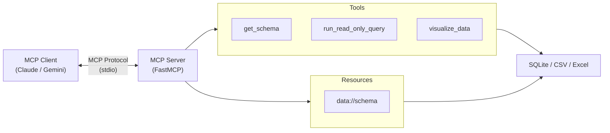

# 📊 Data Analyst MCP Server

An **MCP (Model Context Protocol)** server that turns your LLM into a data analyst. Connect it to a database or data file and get:

- **Schema context** — the LLM automatically sees your tables and columns
- **Safe SQL queries** — ask questions in natural language, get SQL results
- **Data visualization** — generate charts and summary statistics

## 🏗️ Architecture



## ✨ Features

| Feature | Description |
|---------|-------------|
| 🗄️ Multi-source | SQLite databases, CSV files, Excel files |
| 🔒 Read-only safety | Only `SELECT` queries allowed — no accidental data modification |
| 📋 Schema as Resource | LLM sees table structure automatically |
| 📊 Visualization | Bar, line, scatter, pie, and histogram charts |
| 📈 Statistics | Automatic summary statistics with every visualization |
| 📝 Structured Logging | JSON-formatted logs for every operation |
| 🐳 Docker | One-command setup with `docker-compose` |
| ✅ CI/CD | GitHub Actions (lint + test + Docker build) |

## 📁 Project Structure

```
MCP_Data_Analyst/
├── src/
│   ├── server.py            # MCP server entry point
│   ├── db.py                # Database engine (SQLite/CSV/Excel)
│   ├── resources.py         # MCP resources (schema context)
│   ├── logging_config.py    # Structured JSON logging setup
│   └── tools/
│       ├── query.py         # Read-only SQL query tool
│       └── visualize.py     # Chart generation tool
├── tests/
│   ├── conftest.py          # Shared fixtures (in-memory DB)
│   ├── test_db.py           # Schema, validation, execution tests
│   ├── test_tools.py        # Query + visualization tool tests
│   └── test_resources.py    # Resource formatting tests
├── data/                    # Data files directory
├── .github/workflows/
│   └── ci.yml               # GitHub Actions CI pipeline
├── Dockerfile               # Multi-stage Docker build
├── docker-compose.yml       # One-command Docker setup
├── create_sample_db.py      # Generates demo database
├── requirements.txt
└── pyproject.toml
```

## 🚀 Quick Start

### Option 1: Docker (recommended)

```bash
docker-compose up --build
```

The container ships with a pre-built sample database. To use your own data, place it in the `data/` directory and set `DATA_SOURCE` in `docker-compose.yml`.

### Option 2: Local

```bash
# Install dependencies
pip install -r requirements.txt

# Create sample database (optional)
python create_sample_db.py

# Run the server
python -m src.server
```

## ⚙️ Configuration

Set the `DATA_SOURCE` environment variable to point to your data file:

| File Type | Extensions | Notes |
|-----------|-----------|-------|
| SQLite | `.db`, `.sqlite`, `.sqlite3` | Direct connection |
| CSV | `.csv` | Loaded into in-memory SQLite |
| Excel | `.xlsx`, `.xls` | Each sheet becomes a table |

If `DATA_SOURCE` is not set, the server uses `data/sample.db`.

## 🔌 MCP Client Setup

### Claude Desktop

Add to your `claude_desktop_config.json`:

```json
{
  "mcpServers": {
    "data-analyst": {
      "command": "python",
      "args": ["-m", "src.server"],
      "cwd": "/path/to/MCP_Data_Analyst",
      "env": {
        "DATA_SOURCE": "data/sample.db"
      }
    }
  }
}
```

### Gemini CLI

Add to your `settings.json`:

```json
{
  "mcpServers": {
    "data-analyst": {
      "command": "python",
      "args": ["-m", "src.server"],
      "cwd": "/path/to/MCP_Data_Analyst"
    }
  }
}
```

## 🛠️ Available Tools

### `get_schema`
Get the database schema — lists all tables with their columns and types. Call this first to understand what data is available.

**Example prompt:** *"What tables are available in the database?"*

### `run_read_only_query`
Execute safe SQL queries. Results returned as markdown tables (max 100 rows).

**Example prompt:** *"Show me the top 5 highest-paid employees"*

### `visualize_data`
Generate charts from SQL query results.

**Parameters:**
- `sql` — SQL SELECT query
- `chart_type` — `bar`, `line`, `scatter`, `pie`, `hist`
- `x_column` / `y_column` — axis columns (auto-detected if omitted)
- `title` — chart title

**Example prompt:** *"Create a bar chart of total sales by region"*

## 📚 Resources

### `data://schema`
Automatically provides the LLM with the database schema (tables, columns, types) so it can write accurate queries without guessing.

## 📝 Structured Logging

All operations emit structured JSON logs to stderr:

```json
{"timestamp": "2026-02-21 12:00:00", "level": "INFO", "module": "src.db", "message": "db_initialized", "source": "data/sample.db", "type": ".db"}
{"timestamp": "2026-02-21 12:00:01", "level": "INFO", "module": "src.db", "message": "query_executed", "rows": 10, "elapsed_ms": 0.42}
{"timestamp": "2026-02-21 12:00:02", "level": "INFO", "module": "src.tools.visualize", "message": "chart_generated", "chart_type": "bar", "data_points": 4, "image_bytes": 12480}
```

Log events include:
- **`db_initialized`** — data source path and type
- **`query_executed`** — row count and execution time (ms)
- **`chart_generated`** — chart type, data points, image size
- **`query_rejected`** / **`query_error`** — blocked or failed queries

## 🧪 Testing

```bash
# Run full test suite (39 tests)
pytest tests/ -v --tb=short
```

## 🔄 CI/CD

The GitHub Actions pipeline (`.github/workflows/ci.yml`) runs on every push/PR:

1. **Lint** — `flake8` + `black --check`
2. **Test** — `pytest tests/ -v`
3. **Docker Build** — builds the image with Buildx (no push)
